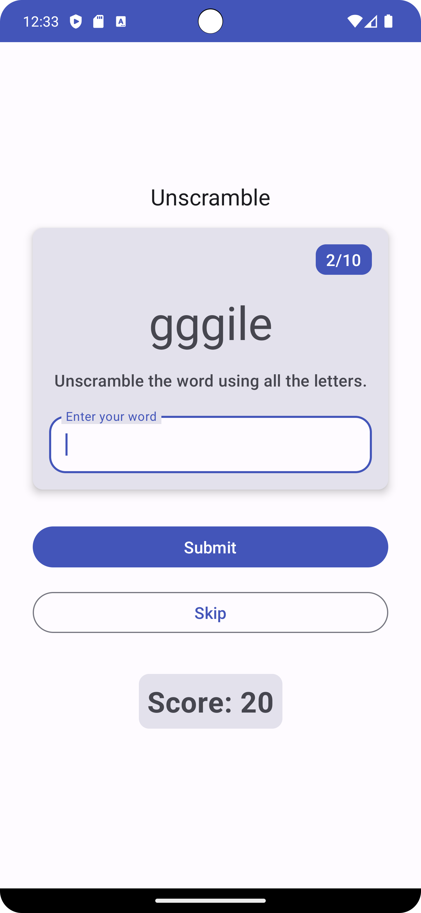
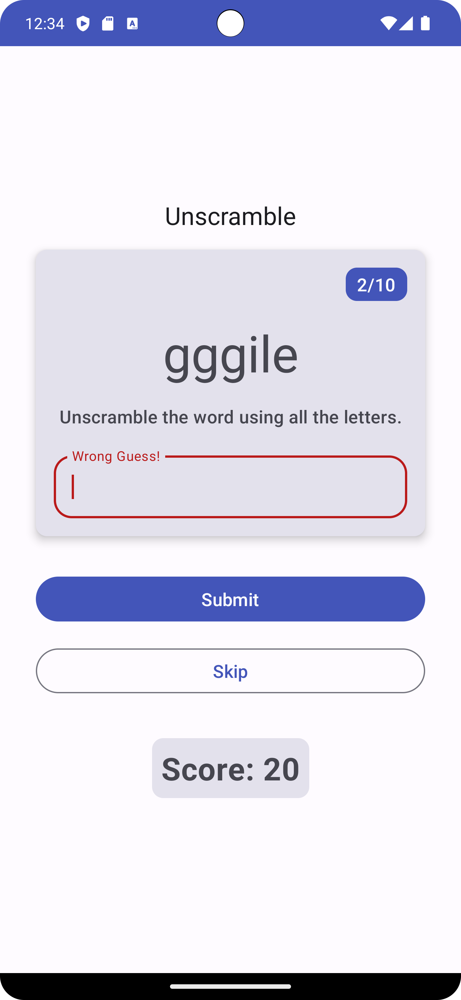
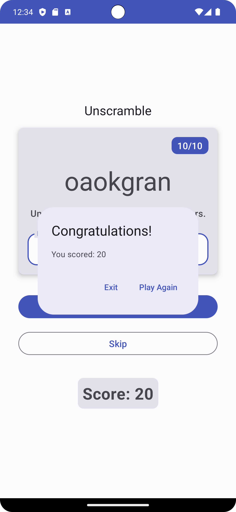

Unscramble app
=================================

Single player game app that displays scrambled words. To play the game, player has to make a
word using all the letters in the displayed scrambled word.
This code demonstrates the Android Architecture component- ViewModel and StateFlow.

It's developed using Jetpack Compose components like ```Column```, ```Button```, ```Text```, ```Image```, and ```Modifier```.

<p align="center">
  
  
  
</p>

Getting Started
---------------
1. Install Android Studio, if you don't already have it.
2. Download the sample.
3. Import the sample into Android Studio.
4. Build and run the sample.
